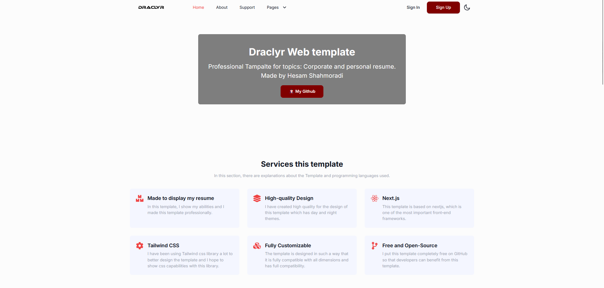
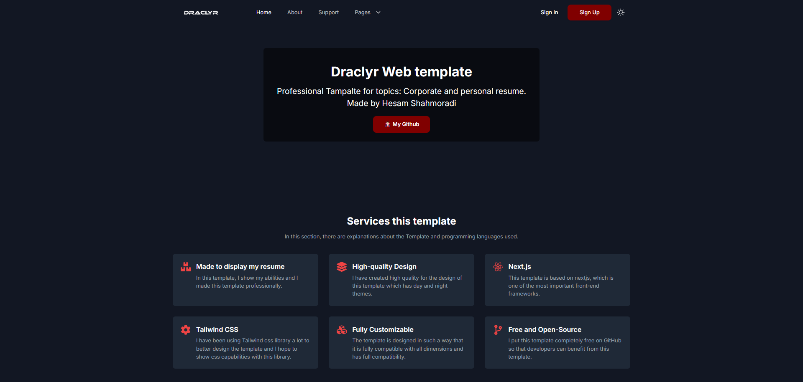
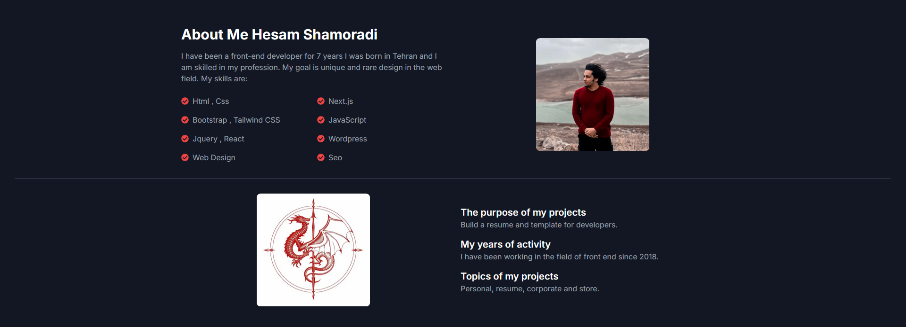
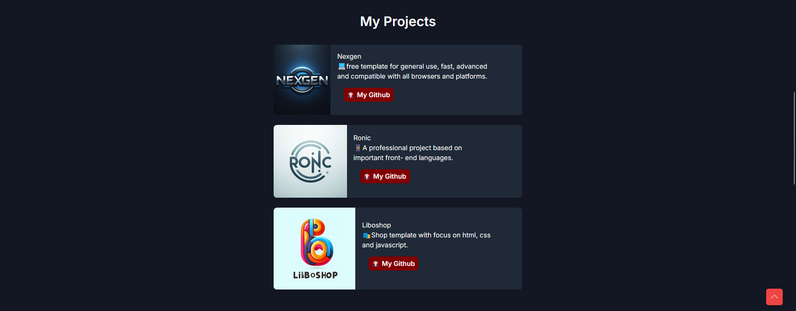
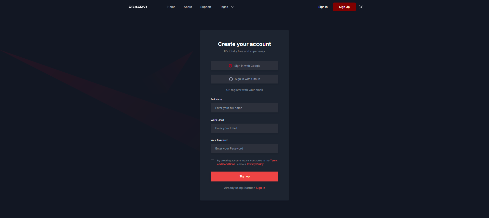

<h2>Idraclyr Template</h2>
<p>✨A TypeScript-based project equipped with comprehensive functionalities, designed to accommodate both corporate and personal applications, including professional resumes. </p>

## Getting Started

Install the template packages via the code below:

```bash
npm install
```
And then run the project with the following code:

```bash
npm run dev
```

then Open [http://localhost:3000](http://localhost:3000) with your browser to see the result.
<br>
<p>🤖This project has a clean and minimal design that makes it ideal for corporate and resume-related themes. Additionally, the day and night theme works well for an advanced user experience:</p>


<br>
<p>In the 'About' section, you may present your skills and relevant information in a structured and specialized manner, ensuring clarity and professionalism:</p>

<br>
<p>You can import the project and adjust the quantity as needed.:</p>

<br>
<p>This template features a highly professional registration and login page that can be further extended to meet specific requirements:</p>

<br>
<p>Finally, I would be delighted if you could rate the project❤️</p>

